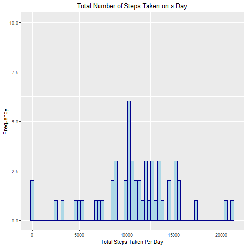
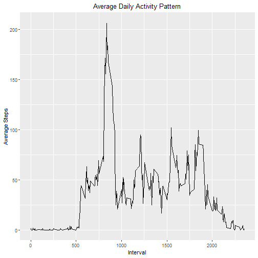
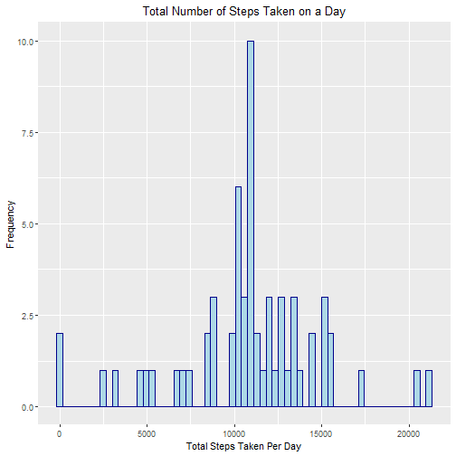
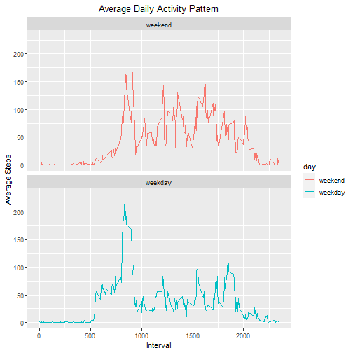

## Introduction

It is now possible to collect a large amount of data about personal movement using activity monitoring devices such as a Fitbit, Nike Fuelband, or Jawbone Up. These type of devices are part of the "quantified self" movement -- a group of enthusiasts who take measurements about themselves regularly to improve their health, to find patterns in their behavior, or because they are tech geeks. But these data remain under-utilized both because the raw data are hard to obtain and there is a lack of statistical methods and software for processing and interpreting the data.

This assignment makes use of data from a personal activity monitoring device. This device collects data at 5 minute intervals through out the day. The data consists of two months of data from an anonymous individual collected during the months of October and November, 2012 and include the number of steps taken in 5 minute intervals each day.

The data for this assignment can be downloaded from the course web site:

-   Dataset: Activity monitoring data

The variables included in this dataset are:

-   steps: Number of steps taking in a 5-minute interval (missing values are coded as 𝙽𝙰)
-   date: The date on which the measurement was taken in YYYY-MM-DD format
-   interval: Identifier for the 5-minute interval in which measurement was taken

The dataset is stored in a comma-separated-value (CSV) file and there are a total of 17,568 observations in this dataset.

# Q1: Loading and preprocessing the data

## Loading and preprocessing the data

Code below is used to load the data, and process/transform the data into a format suitable for analysis.


```r
# Download zipped file and extract
url <- "https://d396qusza40orc.cloudfront.net/repdata%2Fdata%2Factivity.zip"
download.file(url, destfile = "C:\\Users\\tsuim\\Documents\\R\\JHU Data Course\\Module 5\\Project 1\\dataset.zip")
unzip_this <- "C:\\Users\\tsuim\\Documents\\R\\JHU Data Course\\Module 5\\Project 1\\dataset.zip"
unzip(unzip_this, exdir = "C:\\Users\\tsuim\\Documents\\R\\JHU Data Course\\Module 5\\Project 1")
setwd("C:\\Users\\tsuim\\Documents\\R\\JHU Data Course\\Module 5\\Project 1")

# Load packages
library(tidyverse)

# Variables in dataset 
  # steps: Number of steps taking in a 5-minute interval (missing values are coded as \color{red}{\verb|NA|}NA)
  # date: The date on which the measurement was taken in YYYY-MM-DD format
  # interval: Identifier for the 5-minute interval in which measurement was taken
        
# Read data 
activityMonitoring <- read.csv(file = "activity.csv", header = TRUE)

# Reorder columns 
finalDf <- activityMonitoring[,c(2,1,3)]

# Transform date string to dates
finalDf$date <- as.Date(finalDf$date, format = "%Y-%m-%d")
```

# Q2: What is mean total number of steps taken per day?

## Histogram

Plot for the total number of steps per day.


```r
# Group steps by day to get total steps per day, keep NA values
stepsPerDay <- aggregate(steps ~ date, finalDf, sum, na.action = NULL)
stepsPerDay_rmNA <- aggregate(steps ~ date, finalDf, sum)

# Calculate the total number of steps taken per day by plotting histogram
histogram <- ggplot(stepsPerDay, aes(x = steps)) +
  geom_histogram(color="darkblue", fill="lightblue", bins=61) +
  xlab("Total Steps Taken Per Day") + 
  ylab("Frequency") + 
  ggtitle("Total Number of Steps Taken on a Day") +
  theme(plot.title = element_text(hjust = 0.5)) +
  scale_y_continuous(expand = c(0, 0)) + 
  ylim(0, 10) 
```

```
## Scale for 'y' is already present. Adding another scale for 'y', which will replace
## the existing scale.
```

```r
histogram  
```



# Q3: What is mean total number of steps taken per day?

## Mean and median

Calculates and report the mean and median of the total number of steps taken per day.


```r
# Calculate mean and median of the total number of steps taken per day with df that removed missing values 
stepsPerDay_rmNA %>% summarise(Mean_steps = mean(steps), Median_steps = median(steps))
```

```
##   Mean_steps Median_steps
## 1   10766.19        10765
```

# Q4: What is the average daily activity pattern?

## Time series plot

Plots the 5-minute intervals (x-axis) and the average number of steps taken, averaged across all days (y-axis).


```r
# Read data 
activityMonitoring <- read.csv(file = "activity.csv", header = TRUE)

# Reorder columns 
finalDf <- activityMonitoring[,c(2,1,3)]

# Transform date string to dates
finalDf$date <- as.Date(finalDf$date, format = "%Y-%m-%d")

# Time series on average number of steps per interval 
stepsPerInt<- aggregate(finalDf$steps, list(finalDf$interval), mean, na.rm=TRUE) 
names(stepsPerInt) <- c("Interval", "Steps")
timeSeriesPlot <- ggplot(stepsPerInt, aes(Interval, Steps)) +
  geom_line(col="black") +
  xlab("Interval") +
  ylab("Average Steps") + 
  ggtitle("Average Daily Activity Pattern") +
  theme(plot.title = element_text(hjust = 0.5))
timeSeriesPlot
```



# Q5: Imputing missing values

## Imputing missing values

I calculated in the missing values for each interval with the mean of the respective interval. A new data frame with no missing values is generated.


```r
# Read data 
activity <- read.csv(file = "activity.csv", header = TRUE)

# Transform date string to dates
activity$date <- as.Date(activity$date, format = "%Y-%m-%d")

# Total number of missing values in dataset 
sum(is.na(activity$steps)) 
```

```
## [1] 2304
```

```r
# Group steps by 5-min interval to get average steps per day, keep NA values
stepsPerDay <- aggregate(steps ~ interval, activity, mean, 
                         na.action = na.omit)

# Fill in missing data by interval
imputedDf <- activity %>% inner_join(stepsPerDay, by="interval") %>%
  mutate(steps = coalesce(steps.x, steps.y)) %>%
  select(steps, interval)

# Add date column to df
imputedDf <- imputedDf %>% add_column(date = activity$date)

# Reorder columns of new df to match original activity data 
finalDf <- imputedDf[,c("steps", "date", "interval")]
```

## Histogram

Generated a histogram for the dataset without missing values.


```r
# Group steps by day to get total steps per day, keep NA values
stepsPerDay <- aggregate(steps ~ date, finalDf, sum, na.action = NULL)

# Calculate the total number of steps taken per day by plotting histogram
histogram <- ggplot(stepsPerDay, aes(x = steps)) +
  geom_histogram(color="darkblue", fill="lightblue", bins=61) +
  xlab("Total Steps Taken Per Day") + 
  ylab("Frequency") + 
  ggtitle("Total Number of Steps Taken on a Day") +
  theme(plot.title = element_text(hjust = 0.5))
histogram
```



## Mean and Median

Calculated and reported the mean and median total number of steps taken per day using the new dataset with zero NAs.


```r
# Calculate mean and median of the total number of steps taken per day with df that removed missing values 
stepsPerDay %>% summarise(Mean_steps = mean(steps), Median_steps = median(steps))
```

```
##   Mean_steps Median_steps
## 1   10766.19     10766.19
```

# Q5: Are there differences in activity patterns between weekdays and weekends?

## Create new factor variable and generate a time series panel plot.

Create a new factor variable in the dataset with two levels -- "weekday" and "weekend" indicating whether a given date is a weekday or weekend day.

Make a panel plot containing a time series plot (i.e. \color{red}{\verb|type = "l"|}type = "l") of the 5-minute interval (x-axis) and the average number of steps taken, averaged across all weekday days or weekend days (y-axis). See the README file in the GitHub repository to see an example of what this plot should look like using simulated data.


```r
# Transform date string to dates
activity$date <- as.Date(activity$date, format = "%Y-%m-%d")

# Group steps by 5-min interval to get average steps per day, keep NA values
stepsPerDay <- aggregate(steps ~ interval, activity, mean, 
                         na.action = na.omit)

# Fill in missing data by interval
imputedDf <- activity %>% inner_join(stepsPerDay, by="interval") %>%
  mutate(steps = coalesce(steps.x, steps.y)) %>%
  select(steps, interval)

# Add date column to df
imputedDf <- imputedDf %>% add_column(date = activity$date)

# Reorder columns of new df to match original activity data 
finalDf <- imputedDf[,c("steps", "date", "interval")]

# Add column to df to indicate if date is a weekend or weekday 
weekdays <-  c('Monday', 'Tuesday', 'Wednesday', 'Thursday', 'Friday')
finalDf$day <- factor((weekdays(finalDf$date) %in% weekdays), 
                   levels=c(FALSE, TRUE), labels=c('weekend', 'weekday'))

# Panel time series plot for interval and steps
stepsPerInt<- aggregate(steps ~ interval + day, finalDf, mean, na.rm=TRUE) 
timeSeriesPlot <- ggplot(stepsPerInt, aes(x=interval, y=steps, color=day)) +
  geom_line() +
  xlab("Interval") +
  ylab("Average Steps") + 
  ggtitle("Average Daily Activity Pattern") +
  theme(plot.title = element_text(hjust = 0.5)) +
  facet_wrap(~day , ncol = 1, nrow=2)
timeSeriesPlot
```


